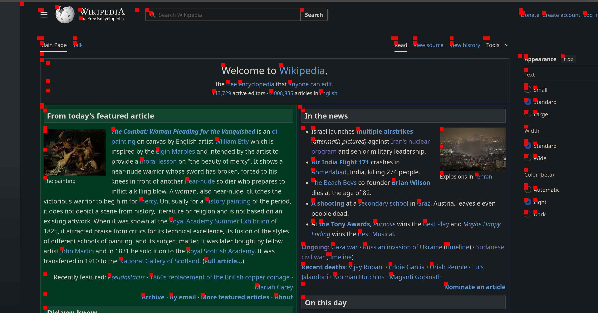

# atspi tree visualizer

A simple program to label each accessible element with a red box. This is just a proof of concept for the time being. Need to update the red boxes on more events.


To run:
```
cargo run
```


